#### TestNG Framework
- TestNG is testing framework inspired from Junit and Nunit
- manage test suites, Test data, Generate reports, logs
- Cover all type of testing : unit, functional, end to end, integration

#### Dependencies
    - 1. SDK : java latest (21)
    - 2. Testng : latest (7.8.0)
    - 3. jcommander : 1.82
    - 4. slf4j-api : 2.0.9
   - You can place it under setting > project structure > Modules > TestNG > Add them as dependencies
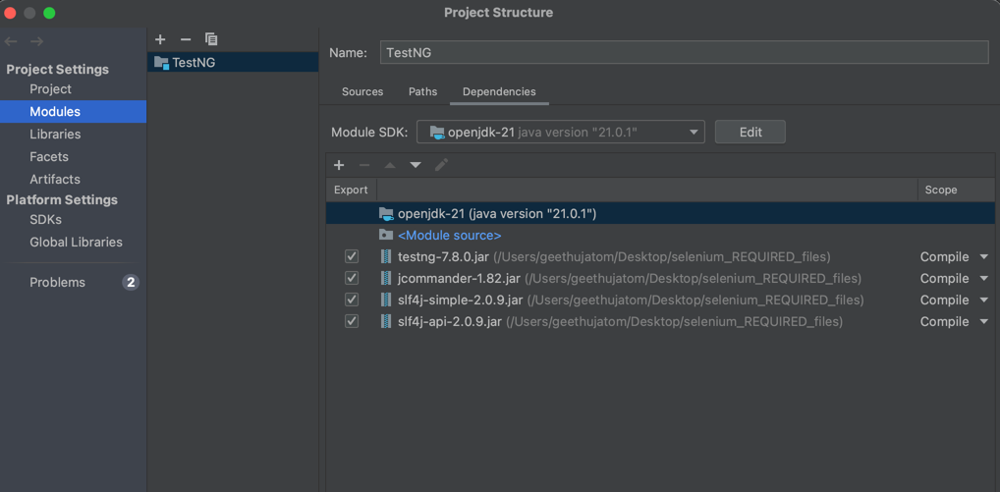

#### Annotations
    - 1. @BeforeSuite
    - 2. @BeforeClass
    - 3. @BeforeMethod
    - 4. @beforeTest
    - 5. @Test
    - 6. @AfterTest
    - 7. @AfterMethod
    - 8. @AfterClass
    - 9. @AfterSuite
    - 10. @BeforeGroup
    - 11. @AfterGroup
    - 12. @DataProvider
    - 13. @Parameters
    - 14. @Factory
    - 15. @Listeners
    - 16. @Ignore

#### Testng.xml 
    - configuration files have information about test execution details
    - you can have any_name.xml
    - you can have many .xml file based on class/ feature
    - it should be added under resource file
    - <suite name="">
        - <test name="" >
            -<classess>
                -<class name="">
                    -<methods>
                        -<includes name=""/>
    - Tag options : name
    - Suite can have multiple tests
    - tests can have classess & methods

#### Parameters
    - you have to pass parameter from testng.xml at suite or test level
    - Suite level : it will available in entire suite
    - test level : only limited to test level
         - <parameter name="username" value="Juan"></parameter>
         - <parameter name="browsername" value="Chrome"></parameter>
    - call paramter by @parameters("") annotation front of test case
        -  @parameters("browsername")
        -  @Parameters({"username","password"}) // more values add inside { }
    - and pass as paramter in method 
        - public void initaliseBrowser(string browserName){}
        - public void login(String username, String password)
	        - {
		        - System.out.println("Username:"+username+" ,Password:"+password);
	        - }
    - Optional Parameters : @Optional
        - default value, will be considers as paramater value
        - use it inside test method 
            - public void initaliseBrowser(@Optional("chrome") string browserName){}
            - public void login(@Optional("Usernameoptional") String username,@Optional("Passwordoptional") String password){}

####  Enable & Disable tests
    - if we have multiple tests, each sprint we have to select few tests to execute
    - for that we need to disable or enable some tests
    - testng.xml > test add property : enabled="true/false"
    - disabled : enabled="false"
    - by deafult it is enabled 
        - <test name="EnableAndDisableTest" enabled="true">
         - <classes>
            - <class name="TestNG.EnableandDisableTest"></class>
        - </classes>
      - </test>

#### Prioritize tests
    - Why ? 
        - TestNG will pick tests based on ASCII value, so we have to specifiy order if we have series of actions
        - eg : login before book the fight
        - Run result without adding priority
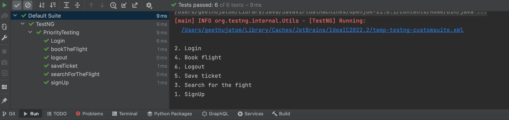

    - How ?
        - 1. specifiy it on testng.xml > test >  under methods > includes in spefified order 
                - if you have more method, this wont be much useable
        - 2. inside test methods > set priority
                - @Test(priority=1)
                - prioirty = 1 is first one to execute
            - Default value of the priority : 0
        - After Adding priority

        - we can pass negative value to priority (priority=-1), will pick up first
        - if we have specify same priority to multiple test methods
            - in same priority , it follows ASCII order 

#### Ignore Tests 
    - 1. Ignore the specific test methods
        - @Ignore annotation top of test methods
        - @Test(enabled = false)
    - 2. Ignore all the test methods in testing class
        - Place @ignore annotation in the class level 
        - no tests inside class will not execute
    - 3. Ignore all test methods in a package
        - create file : package-info.java ( right click on package > create package-info.java file in IntelliJ)ß
        - add @ignore annotation 

#### Group Tests
    - Why ? catogorize tests 
    - Smoke test, functional, regression, OS based test(windows, ios), daily build , weekly build
    - How ?
    - 1. create multiple testng.xml files, eg: smoke.xml, regression.xml
    - 2. within one testng.xml file 
            - add paramter in test method/ class level 
            - @BeforeClass(groups={"Sanity","Regression","database"})
    - Type of groups:
        - 1. Test groups
            - Add <groups> <run> <include name="smoke"/>
        - 2. Exclusion groups
            - if you want to execlude some group, you can add it under <exclude name="regression"/>
        - 3. Group of groups : meta groups
                - define groups in daily build , weekly build
                - in testng.xml,under <groups>
                - <test name="GroupTest">
                    - <groups>
                        - <define name="dailyBuild">
                            - <include name="Sanity" />
                            - <include name="functional" />
                        - </define>
                        - <define name="weeklyBuild">
                            - <include name="Sanity" />
                            - <include name="functional" />
                            - <include name="Regression" />
                            - <include name="database" />
                        - </define>
                        - <run>
                            - <include name="weeklyBuild"></include>
                            - <exclude name="Regression"></exclude>
                        - </run>
                    - </groups>
                    - <classes>
                        -  <class name="TestNG.GroupTest"></class>
                    - </classes>
                 - </test>
            - 4. Partial Groups :
                - groups are defined in test level , will not execute in different test.
                - if you want to execute, you need to define it on required test
        - we have define groups in suite level if you want to execute in all tests
        - You can execute groups on suite and test level
 
#### create Dependencies 
    - What is Test dependency ?
        - 1. createShipment - will create tracking number
        - 2. trackShipment - trackNum
        - 3. cancelShipment -trackNum 
        - if first test case is failed , there is no point in running other tests. 
        - You can wait on another tests to be successful
    - Why we need it ? 
        - dependency test is failed, we need to skip other test cases
    - How ?
        - create dependecy on test methods and test groups as well
        - 1. Test methods
            - dependsOnMethods ={"createShipment"}
            - Refer it on other tests @Test(dependsOnMethods = {"createShipment"})
        - 2. Test Groups
            - we need to execute a test after set of dependent tests are executed
            - we can group them into one group 
            - main test , addd paramter  dependsOnGroups = {"Smoke"} to @Test
            - if any failure in group tests, main test will not be executed, it is skipped
            - Test methods  depend on > test groups
            - test groups depeneds on > test groups
                - testng.xml :
                   - <groups>
                        - <dependencies>
                            - <group name="sanity" depends-on="smoke"></group>
                            - <group name="regression" depends-on="sanity"></group>
                        -  </dependencies>
                    - </groups>
            - Smoke -> Snity -> Regression -> ReleaseTesting -> prodTesting
    - what happens when priority is set to test methods?
        - priotiy  is not considered
        - when we set priority on top of dependcy test methods, testNG ignore priority
    - What happens when dependent test is failed?
        - even dependent test is failed , but we need to run other tests 
        - we can add alwaysRun = true paramter to @Test
        - @Test(dependsOnMethods = {"createShipment"}, alwaysRun = true)
    - What happens when dependent  test is ignored/skipped/deleted?
        - Ignore : will not run method
        - depenedent test is skipped/ deleted/ ignored : use ignoreMissingDependencies = true parameter to @Test
                
#### Dataprovider
    - What ?
        - container which can pass test data sets to test methods
    - Why ?
        - verify the tests with multiple set of data
        - paramterize test data to test methods
    - How ?
        - use annotation : @DataProvider(name="data") and keep data
            - @DataProvider(name="data")
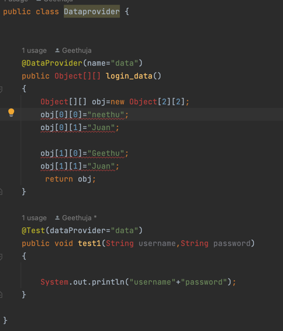
    - What happens if we dont provide a name to dataprovider ?
        - we will get exception, data provider can not find out
        - You can use method name as data provider name
    - Is it mandatory to return Object[][] from the dataprovider ?
        - No, we have other return types
    - What are the return types of dataprovider?
        - Object[] (single dimensional array)
        - Object[][] (multi dimensional array)
        - Iterator<Object>
        - Iterator<Object[]>
    - How do we specify the parameters in method signature of test method?
        - Object - any data type (pre-defined {string, integer, float} /user defined{Employee[], car[])
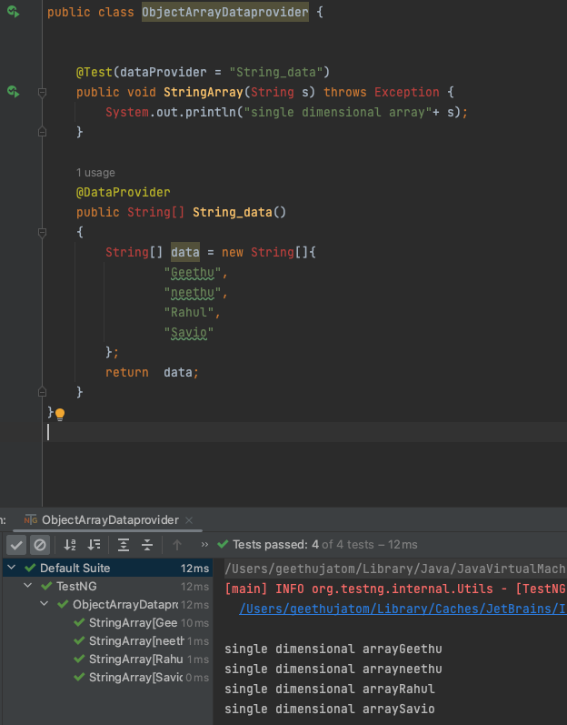

        - Object array can hold both string and integer values
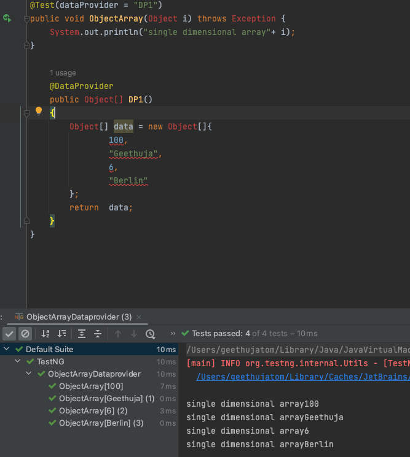
        - Multi dimensional Array
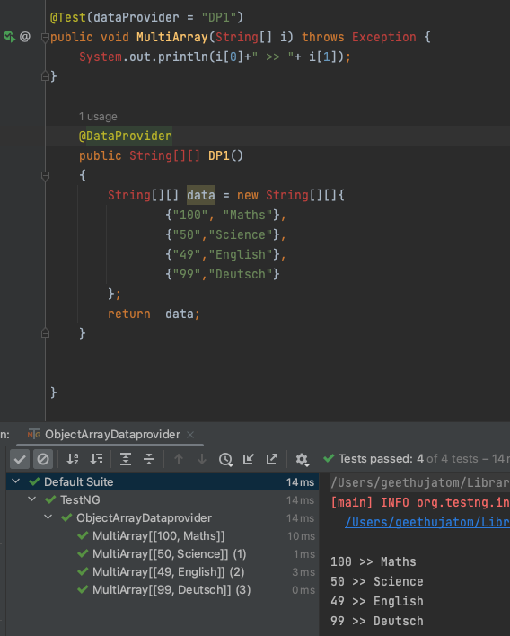
        - use as parameters inside test method (string username , String password)
        - Jagged Array: row count and column count are not fixed
            - so we can use single dimensional array
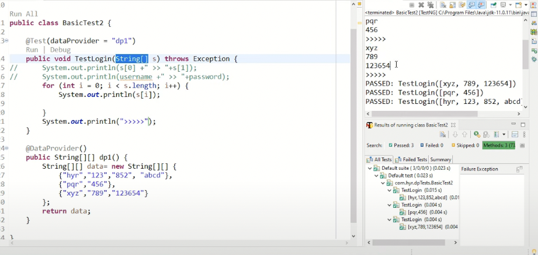
        - When to use Iterator ?
            - if you are stored data as form of collections (sets, list etc)
        - When to use Iterator<object[]> ?
            - if you add iterator of string arrays
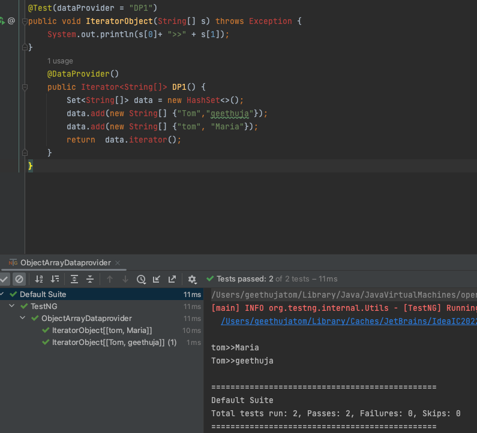
        - Indices : use some of dataprovider data (partial data)
        - test data index is known as indices
            - {"geethu", "neethu", "mathu", "juan"}
            - we need only geethu and mathu , ie 0,2 index
        - parameter name : @DataProvider(indices = {0,2})
        - WHat happened if you use not indices?
            - we will pass all test data to test run
            - we have 100 sets , we have test run 2/100 failed 
            - we need to debug why those two failed 
            - we can use indices concept
        - Can we Separate data provider from test class?
            - Yes, by default test looking for dataProvider in same class
        - What is dataProviderClass ? Why do we use the dataProviderClass?
            - Parameter inside @test annotation ;dataProviderClass
            - @Test(dataProvider = "String_data", dataProviderClass = DataSupplier.class)
            - Why ? to specify where data is available 
        - How to use dataProviderClass?
            -  We have another java class which keep test data: DataSupplier.java
            - 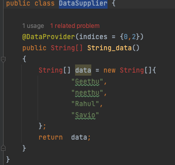
            - add to @test;
            - 
        - can we have multiple dataProvider in dataProviderClass ?
            - Yes, using different method name ,string_data, DP2
            - 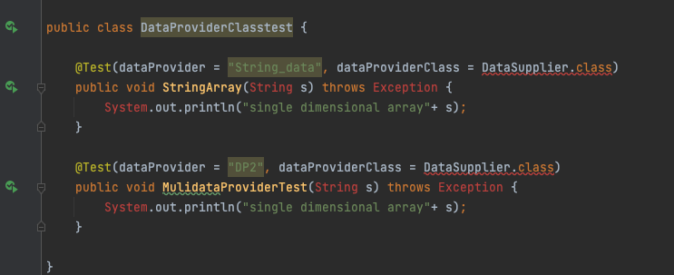
            - 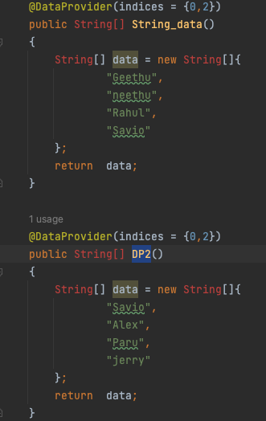
        - Can we have multiple dataprovider class in a project?
            - Yes, we are specifying data provider class and specify methods, 
            - so it won't be any problem if we have multiple data supplier class

    ##### Integration of Excel with dataprovider
        - Libraries available for reading the data from Excel file
            - Excel file -> xls(older version){H}, xlsx{X}
            - Apache POI java library, JXL
            - Apache POI java library supports both version 
            - JXL is fast but it only support xls
        - How to read data from excel file dynamically?
                - Workbook > sheet > row > cell
                - 1. Get File instance using File 
                - 2. Get row data using FileInputstream 
                - 3. convert row data into excel workbook format
                - 4. get workbook(XSSFWorkbook), get sheet by sheetname (XSSFSheet)
                - 5. get rows and Iterate through row( find no of rows = .getPyscialNumberOfRows)
                - 6. get no of  columns (getRow(0).getLastCellNum()
                - 7. get cell (getRow(i).getCell(i).getStringCellvalue())
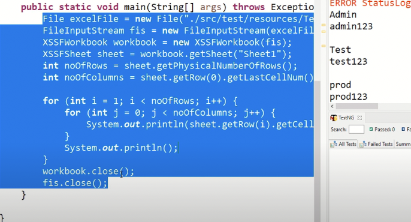
                - DataFormatter : convert any type fo data into normal text data
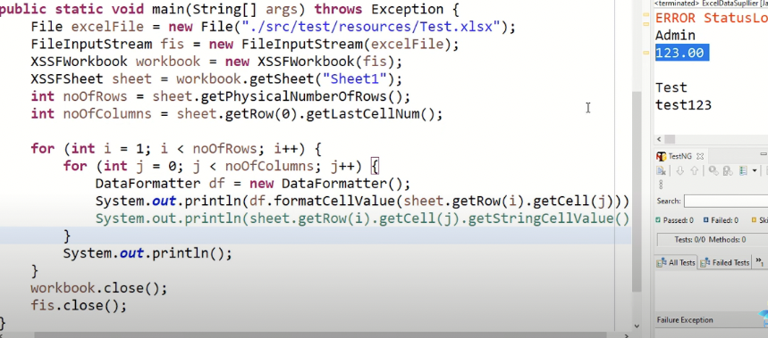
                - using object array
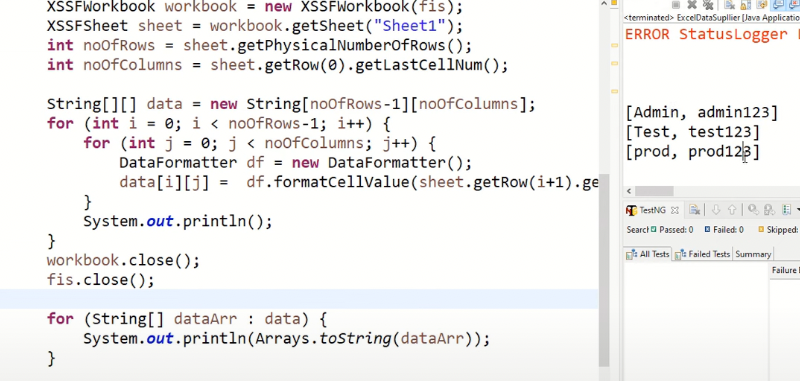
        - How to create dataprovider by reading the data from execl file?
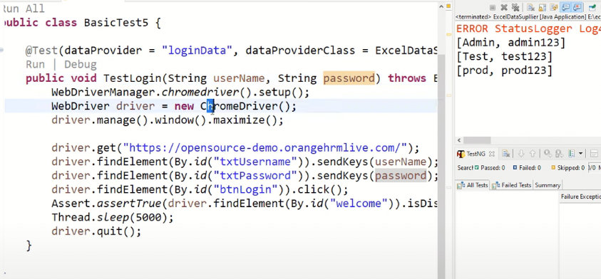
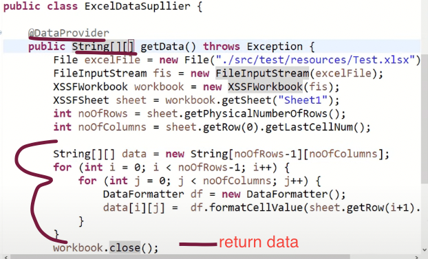
        - How to maintain the dataprovider in separate class ?
            - we only need to modify execl file, no need to modify code
            - Increase test data or reduce test data is easy 
##### Parallel execution with dataProvider
        - by default , it is executing sequencally 
        - parallel execution saves time 
        - How ?
            - pass parameter to @Dataprovider
            - @DataProvider(parallel = true)
            - if we have more test data , we need to control thread count
            - Specify it on testng.xml at suite level
   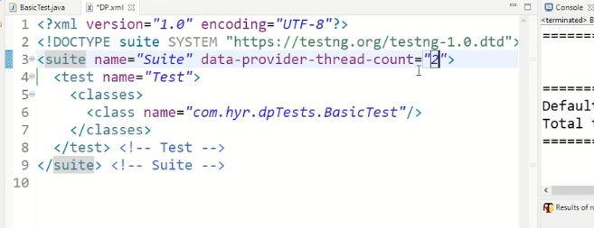
            